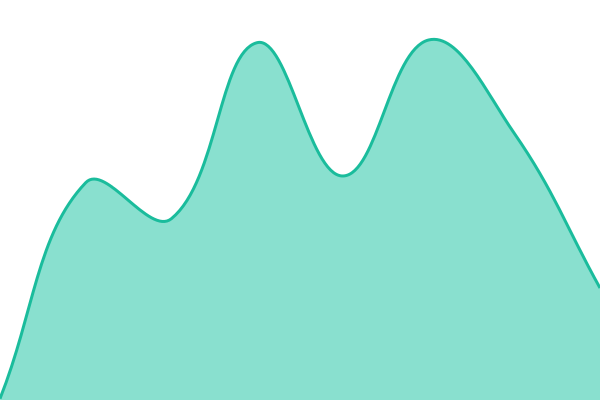
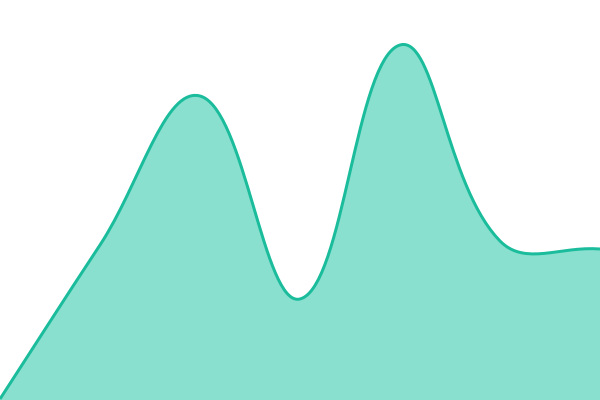
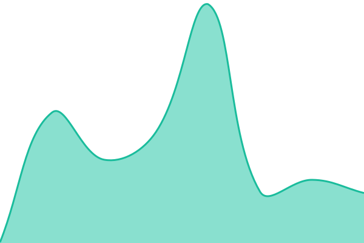

# [📈 Live Status](https://CodeNexus26.github.io/ziplineos-status): <!--live status--> **🟩 All systems operational**

This repository contains the open-source uptime monitor and status page for [Code Nexus](https://CodeNexus26.github.io/ziplineos-status), powered by [Upptime](https://github.com/upptime/upptime).

With [Upptime](https://upptime.js.org), you can get your own unlimited and free uptime monitor and status page, powered entirely by a GitHub repository. We use [Issues](https://github.com/CodeNexus26/ziplineos-status/issues) as incident reports, [Actions](https://github.com/CodeNexus26/ziplineos-status/actions) as uptime monitors, and [Pages](https://CodeNexus26.github.io/ziplineos-status) for the status page.

<!--start: status pages-->
<!-- This summary is generated by Upptime (https://github.com/upptime/upptime) -->
<!-- Do not edit this manually, your changes will be overwritten -->
<!-- prettier-ignore -->
| URL | Status | History | Response Time | Uptime |
| --- | ------ | ------- | ------------- | ------ |
|  [API](https://api.ziplineos.com.au/health) | 🟩 Up | [api.yml](https://github.com/CodeNexus26/ziplineos-status/commits/HEAD/history/api.yml) | 

 667ms
     
 | 

<a href="https://CodeNexus26.github.io/ziplineos-status/history/api">100.00%</a>
    

|  [Kernel](https://admin.ziplineos.com.au) | 🟩 Up | [kernel.yml](https://github.com/CodeNexus26/ziplineos-status/commits/HEAD/history/kernel.yml) | 

 176ms
     
 | 

<a href="https://CodeNexus26.github.io/ziplineos-status/history/kernel">100.00%</a>
    

|  [Registry](https://id.ziplineos.com.au) | 🟩 Up | [registry.yml](https://github.com/CodeNexus26/ziplineos-status/commits/HEAD/history/registry.yml) | 

 156ms
     
 | 

<a href="https://CodeNexus26.github.io/ziplineos-status/history/registry">100.00%</a>
    

|  [CRM](https://crm.ziplineos.com.au) | 🟩 Up | [crm.yml](https://github.com/CodeNexus26/ziplineos-status/commits/HEAD/history/crm.yml) | 

 196ms
     
 | 

<a href="https://CodeNexus26.github.io/ziplineos-status/history/crm">100.00%</a>
    

|  [Broadcast](https://broadcast.ziplineos.com.au) | 🟩 Up | [broadcast.yml](https://github.com/CodeNexus26/ziplineos-status/commits/HEAD/history/broadcast.yml) | 

 213ms
     
 | 

<a href="https://CodeNexus26.github.io/ziplineos-status/history/broadcast">100.00%</a>
    

|  [Input](https://input.ziplineos.com.au) | 🟩 Up | [input.yml](https://github.com/CodeNexus26/ziplineos-status/commits/HEAD/history/input.yml) | 

 172ms
     
 | 

<a href="https://CodeNexus26.github.io/ziplineos-status/history/input">100.00%</a>
    

|  [Collect](https://collect.ziplineos.com.au) | 🟩 Up | [collect.yml](https://github.com/CodeNexus26/ziplineos-status/commits/HEAD/history/collect.yml) | 

 193ms
     
 | 

<a href="https://CodeNexus26.github.io/ziplineos-status/history/collect">100.00%</a>
    

|  [Drive](https://drive.ziplineos.com.au) | 🟩 Up | [drive.yml](https://github.com/CodeNexus26/ziplineos-status/commits/HEAD/history/drive.yml) | 

 182ms
     
 | 

<a href="https://CodeNexus26.github.io/ziplineos-status/history/drive">100.00%</a>
    

|  [Telemetry](https://telemetry.ziplineos.com.au) | 🟩 Up | [telemetry.yml](https://github.com/CodeNexus26/ziplineos-status/commits/HEAD/history/telemetry.yml) | 

 213ms
     
 | 

<a href="https://CodeNexus26.github.io/ziplineos-status/history/telemetry">100.00%</a>
    

|  [Protocol](https://protocol.ziplineos.com.au) | 🟩 Up | [protocol.yml](https://github.com/CodeNexus26/ziplineos-status/commits/HEAD/history/protocol.yml) | 

 163ms
     
 | 

<a href="https://CodeNexus26.github.io/ziplineos-status/history/protocol">100.00%</a>
    

|  [Logic](https://logic.ziplineos.com.au) | 🟩 Up | [logic.yml](https://github.com/CodeNexus26/ziplineos-status/commits/HEAD/history/logic.yml) | 

 194ms
     
 | 

<a href="https://CodeNexus26.github.io/ziplineos-status/history/logic">100.00%</a>
    

<!--end: status pages-->

[**Visit our status website →**](https://CodeNexus26.github.io/ziplineos-status)

## 📄 License

- Powered by: [Upptime](https://github.com/upptime/upptime)
- Code: [MIT](./LICENSE) © [Anand Chowdhary](https://anandchowdhary.com)
- Data in the `./history` directory: [Open Database License](https://opendatacommons.org/licenses/odbl/1-0/)
